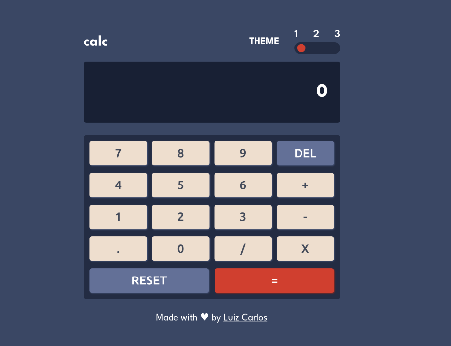
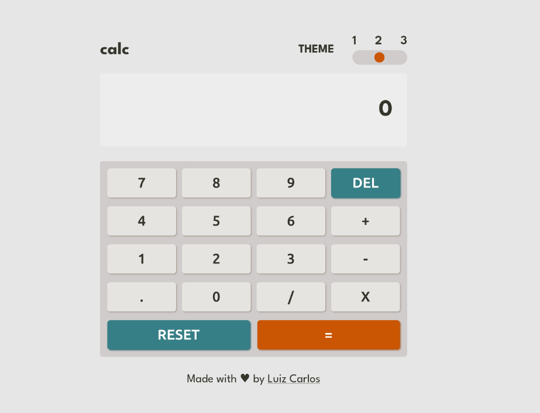
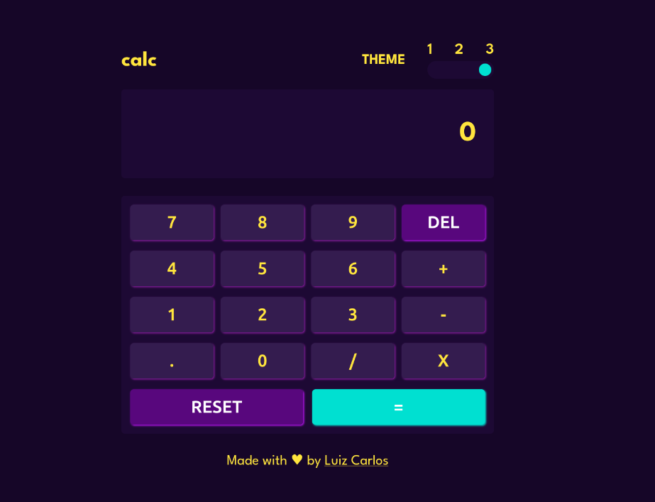

# Simple calculator built using HTML, Css and Javascript

## About the project

---------------------

This is a challenge from [Frontend Mentor's website](https://www.frontendmentor.io/home). It is a calculator with simple operations, including addition, subtraction, multiplication and division, including extra features like a theme switcher which allows you to choose between three different color themes and also a simple error message that appears when you try to calculate a no valid mathematical expression, which can be transformed into a more styled component soon as possible.

All the basic functionalities are working, which included delete a single value from the calculator screen and reset its value to zero. You can only add a operator to the screen after adding a number, and it's not allowed to type a second operator after including one. Also, the result button receives a disabled attribute after a operator signal is added to the calculator screen, which avoids eventual errors in the calculate process.

This project explores common Javascript concepts as well, like functions, conditional structures(if & else, switch case) and DOM manipulation, which includes getting values from and attributing and removing attributes to the HTML elements.

Lastly, this project have a significantly css code including small animations when the screen is loaded and in the link which redirects to my [Github profile](https://github.com/developer-luizcarlos).

You can use this code as you wise for studying purposes. I hope you liked.

## Themes

-------------

### Theme 1

### Theme 2

### Theme 3

